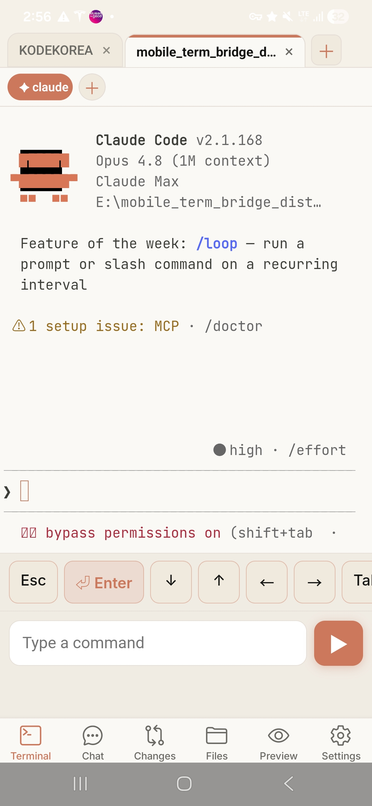
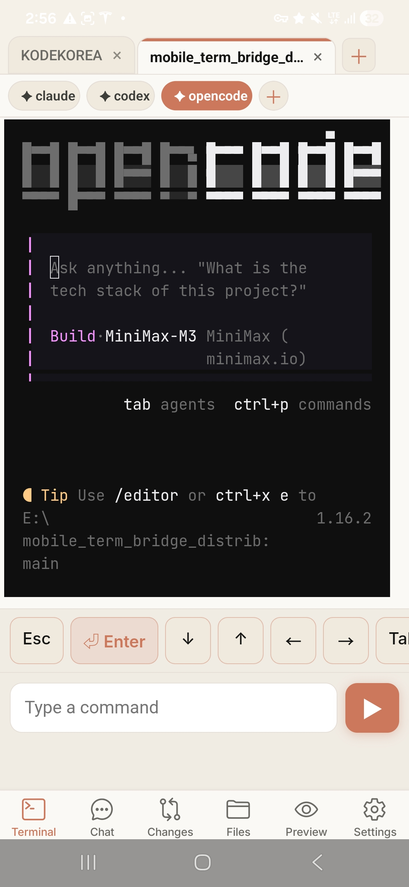
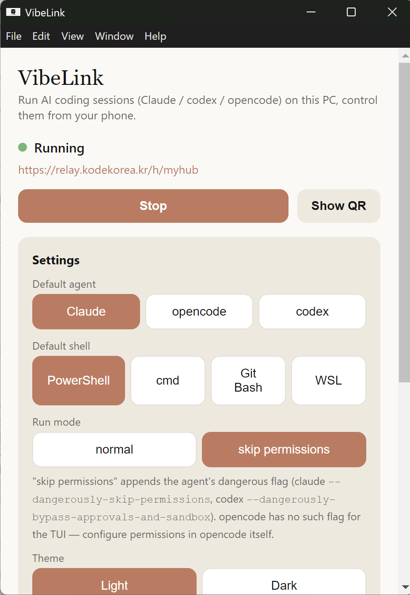
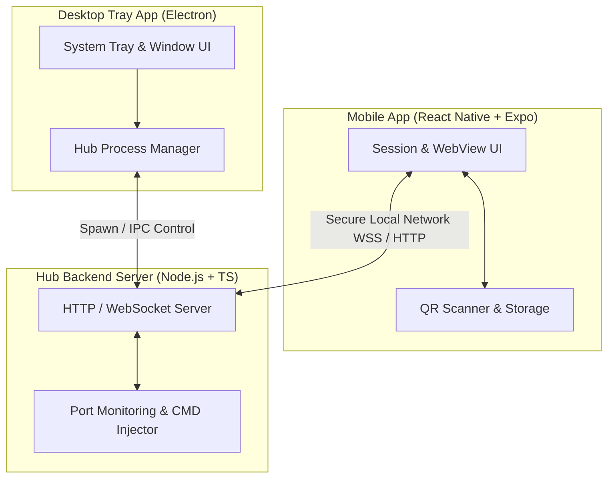

# 🌟 VibeLink (Mobile Terminal Bridge)

> **A premium, high-performance, and secure bridge to mirror, monitor, and control your desktop terminals and workspaces directly from your mobile device.**
>
> 🌐 **Landing Page:** [vibelink.kodekorea.kr](https://vibelink.kodekorea.kr)

<p align="left">
  <a href="https://github.com/kodekorea/vibeLink/releases/download/v0.1.0/VibeLink_Setup_0.1.0.exe">
    
  </a>
  <a href="https://github.com/kodekorea/vibeLink/releases/download/v0.1.0/VibeLink.apk">
    
  </a>
  <a href="https://expo.dev/accounts/kodekorea/projects/vibelink/builds/e3bb03e1-4bf4-418a-bfe5-dbc01640788f">
    
  </a>
</p>

---

<p align="center">
  <a href="#-english">🇺🇸 English</a> | 
  <a href="#-한국어">🇰🇷 한국어</a>
</p>

---

## 🇺🇸 English

VibeLink is a single-user companion utility designed for developers who want to stay connected to their development environment while on the move. By bridging a native Android application (built with Expo) and a desktop tray application (built with Electron), VibeLink lets you run AI coding agents on your PC, open multiple workspaces at the same time, switch between mobile tabs, inspect active ports, review git file changes, and receive completion notifications when long-running agent work needs your attention.

### 🎨 Visual Showcase & Features

| Terminal (Claude Code TUI) | Terminal (opencode TUI) | Screen Mirroring (Remote View) |
| :---: | :---: | :---: |
|  |  |  |
| **Interactive CLI Agents**<br>Control coding agents like Claude Code directly via native terminal tabs. | **Custom CLI Environments**<br>Access opencode and other terminal TUIs with specialized touch controls. | **Real-time Screen Share**<br>Inspect active multi-monitor workspaces and zoom in/out with ease. |

| File Browser | File Viewer (Markdown) | Git changes |
| :---: | :---: | :---: |
|  |  |  |
| **Workspace File Explorer**<br>Browse your remote project directory from the palm of your hand. | **Markdown Document Viewer**<br>Read documents and codes with native markdown styling. | **Git Tracking**<br>Inspect unstaged changes and file statuses of your active repository. |

| Agent Chat Room | Companion App Settings | Desktop Settings (Tray App) |
| :---: | :---: | :---: |
|  |  |  |
| **Chat History at a Glance**<br>Monitor agent messages, command output, and session status in one timeline. | **Quick Configuration**<br>Connect via QR, change themes (light/dark), choose default agents, and set completion alarms. | **Desktop Controller Panel**<br>Start/stop the hub, choose default shells, configure run modes, and expose relay/QR pairing. |

---

### ✨ Key Features

- 💻 **Electron Desktop Controller**: A lightweight system tray application that manages the background hub server, QR/relay pairing, default shells, run modes, and desktop settings.
- 📱 **Native Android Companion (Expo)**: A fast React Native app organized around the mobile coding workflow:
  - **Multi-Workspace Tabs**: Open several workspaces and AI agent sessions at the same time, then switch between them from your phone.
  - **Active Session Bar**: A Chrome-style tab interface that tracks and blends with your active session.
  - **Dynamic Port Detection**: Live port detection and status monitoring for running local development servers.
  - **Quick Action Pads**: Dedicated Enter, arrow, Tab, Ctrl+C, and command controls for terminal work on mobile.
  - **Git File Changes**: Inspect changed files before continuing agent work.
  - **Chat History at a Glance**: Review agent messages, command output, and session status in one timeline.
  - **Completion Notifications**: Configure alarms so your phone notifies you when an agent finishes a long-running task or needs follow-up input.
  - **QR Code Pairing**: Instantly connect your mobile app to your desktop server by scanning a local QR code.
- 🤖 **Supported Agents**: Claude, Codex, OpenCode, GrokBuild, and AGY.
- 🖥️ **Platform Support**: Android + Windows are supported now. Linux, macOS, and iOS are planned.
- 🔒 **Secure-by-Design**: Single-user authorization using robust, local-first passwords and tokens so your workspace stays under your control.

---
### 🏗️ Architecture



---

### 📋 Prerequisites

#### For General Users (Using Pre-built Binaries)
No complex installations are required. Just ensure the following:
* **Network:** Both your desktop PC and mobile device must be connected to the **same local network (Wi-Fi)** to establish a direct connection.
* **Windows (.exe):** Default shells (`PowerShell` and `CMD`) work out of the box. If you want to use `WSL` or `Git Bash` via VibeLink, they must be pre-installed on your PC.
* **Android (.apk):** Since this app is installed outside the Google Play Store, you must allow **"Install unknown apps"** in your Android security settings.

#### For Developers (Building from Source)
* **Common:** Node.js (LTS version recommended)
* **Mobile (Local Build):** JDK 17, Android Studio, Android SDK configured in your environment variables (`ANDROID_HOME`), and USB Debugging enabled on your Android device.
* **Mobile (EAS Cloud Build):** Expo Account & EAS CLI installed.

---

### 🚀 Getting Started

#### 💿 Direct Download (Recommended)
You can directly download precompiled binaries from our **[GitHub Releases v0.1.0](https://github.com/kodekorea/vibeLink/releases/tag/v0.1.0)**:
* **Windows (.exe)**: Download and run **[VibeLink Setup 0.1.0.exe](https://github.com/kodekorea/vibeLink/releases/download/v0.1.0/VibeLink_Setup_0.1.0.exe)** to run the setup wizard.
* **Android (.apk)**: Download the **[VibeLink.apk](https://github.com/kodekorea/vibeLink/releases/download/v0.1.0/VibeLink.apk)** directly or scan the QR code from the **[EAS Build Page](https://expo.dev/accounts/kodekorea/projects/vibelink/builds/e3bb03e1-4bf4-418a-bfe5-dbc01640788f)**.

---

#### 🛠️ Build & Run from Source (Advanced)

##### 1. Desktop App Installation (Windows)
To build the desktop installer from source:
1. Install dependencies and pack the package:
   ```bash
   cd desktop
   npm install
   npm run dist
   ```
2. Locate the generated installer at `desktop/dist/VibeLink Setup 0.1.0.exe`.
3. Launch the installer, run the setup wizard, and launch VibeLink from your Windows system tray.

##### 2. Mobile App Setup (Android)

You can run the mobile app using Expo or compile a local APK.

**Option A: Cloud Build (EAS)**
If you don't have Android Studio set up, you can trigger a cloud build to get a direct-install `.apk`:
```bash
cd mobile
npm install -g eas-cli
eas login
eas build --platform android --profile preview
```

**Option B: Local Development Run**
1. Install **JDK 17** and **Android Studio** (on Windows, you can use `winget`):
   ```powershell
   winget install EclipseAdoptium.Temurin.17.JDK
   winget install Google.AndroidStudio
   ```
2. Configure environment variables: Set `ANDROID_HOME` to your Android SDK path, and add `%ANDROID_HOME%\platform-tools` to your `Path`.
3. Connect your Android device via USB (with USB Debugging enabled) and run:
   ```bash
   cd mobile
   npm run android
   ```

---

## 🇰🇷 한국어

**VibeLink**는 이동 중에도 자신의 개발 환경과 연결을 유지하려는 개발자를 위해 제작된 1인용 유틸리티입니다. 네이티브 안드로이드 앱(Expo 기반)과 데스크톱 트레이 앱(Electron 기반)을 연동하여, Claude/Codex/OpenCode/GrokBuild/AGY 실행, 여러 워크스페이스 동시 작업, 터미널 탭 전환, Git 변경 확인, 화면 프리뷰, 완료 알림, 키스트로크 입력 등을 로컬 네트워크 내에서 안전하게 수행할 수 있습니다.

🌐 **공식 소개 페이지:** [vibelink.kodekorea.kr](https://vibelink.kodekorea.kr)

<p align="left">
  <a href="https://github.com/kodekorea/vibeLink/releases/download/v0.1.0/VibeLink_Setup_0.1.0.exe">
    
  </a>
  <a href="https://github.com/kodekorea/vibeLink/releases/download/v0.1.0/VibeLink.apk">
    
  </a>
  <a href="https://expo.dev/accounts/kodekorea/projects/vibelink/builds/e3bb03e1-4bf4-418a-bfe5-dbc01640788f">
    
  </a>
</p>

### 🎨 시각 자료 및 주요 기능

| 터미널 (Claude Code TUI) | 터미널 (opencode TUI) | 실시간 화면 미러링 (원격 뷰) |
| :---: | :---: | :---: |
|  |  |  |
| **대화형 CLI 에이전트**<br>모바일 터미널 탭을 통해 Claude Code 같은 코딩 에이전트를 실시간 제어합니다. | **TUI 작업 영역 연동**<br>opencode 등 풍부한 TUI 개발 도구들을 퀵 키패드로 편리하게 조작합니다. | **원격 멀티 모니터 뷰**<br>원격 PC의 다중 모니터 작업 화면을 미러링하고 확대/축소하며 모니터링합니다. |

| 파일 탐색기 | 마크다운 파일 뷰어 | Git 변경사항 트래커 |
| :---: | :---: | :---: |
|  |  |  |
| **원격 디렉토리 브라우저**<br>원격지 프로젝트 워크스페이스의 파일 트리를 손쉽게 탐색합니다. | **마크다운 뷰어**<br>마크다운으로 작성된 문서 및 코드를 정돈된 스타일로 즉시 확인합니다. | **Git 상태 관리**<br>현재 작업 중인 저장소의 스테이징되지 않은 변경 파일들을 체크합니다. |

| 에이전트 채팅룸 | 모바일 앱 설정 | 데스크톱 컨트롤러 (트레이 앱) |
| :---: | :---: | :---: |
|  |  |  |
| **에이전트 로그 스트리밍**<br>백그라운드 에이전트의 작업 이력을 챗봇 스타일 인터페이스로 확인합니다. | **빠른 환경설정**<br>QR 코드를 통한 페어링, 라이트/다크 테마, 다국어 및 완료 알림 설정 제공. | **데스크톱 제어 패널**<br>허브 가동 상태 확인, 기본 쉘 선택 및 권한 예외 플래그 구성 지원. |

---

### ✨ 주요 기능 요약

- **데스크톱 트레이 앱 (Electron)**: 시스템 트레이에 상주하며 백그라운드 허브 서버를 가동 및 모니터링하고 설정 제어판을 제공합니다.
- **모바일 동반 앱 (Expo)**: 아래의 편의 기능을 탑재한 네이티브 React Native 앱입니다.
  - **세션 탭 바**: 활성화된 세션의 터미널을 편리하게 관리하는 탭 인터페이스.
  - **동적 포트 감지**: 구동 중인 개발 서버 포트를 감지해 리스트로 제공 (활성 포트는 `●`로 노출).
  - **퀵 액션 키패드**: 방향키, 엔터, 탭 등 터치 기반 터미널 전용 퀵 키보드 레이어.
  - **매크로 폴더링**: 자주 사용하는 일련의 CLI 명령을 그룹화해 단 한 번의 탭으로 순차 실행.
  - **QR 코드 페어링**: 복잡한 네트워크 주소 입력 없이 데스크톱 화면의 QR을 스캔하여 로컬 매핑 완료.
  - **여러 워크스페이스 동시 작업**: 여러 프로젝트와 AI 에이전트 세션을 동시에 열고 모바일 탭에서 빠르게 전환하며 작업할 수 있습니다.
  - **완료 알림 기능**: 에이전트가 긴 작업을 끝냈거나 추가 입력이 필요할 때 모바일 알림으로 확인할 수 있습니다.
- **지원 에이전트**: Claude, Codex, OpenCode, GrokBuild, AGY.
- **플랫폼 지원**: 현재 Android + Windows를 지원하며, Linux, macOS, iOS는 지원 예정입니다.
- **철저한 로컬 중심 보안**: ngrok 등 외부 서드파티 터널링을 차단하고, 로컬 네트워크상에서 보안 인증 토큰 및 비밀번호를 적용하여 1인 단일 사용자 환경을 철저히 보호합니다.

---

### 📋 요구사항 (Prerequisites)

#### 일반 사용자 (빌드 파일 실행 시)
복잡한 사전 설치 없이 바로 사용할 수 있습니다. 단, 아래의 네트워크 및 보안 설정만 확인해 주세요.
* **네트워크:** 데스크톱 PC와 모바일 기기가 **동일한 로컬 네트워크 (같은 Wi-Fi 공유기)**에 연결되어 있어야 직접 연동이 가능합니다.
* **Windows (.exe):** 기본 탑재된 `PowerShell` 및 `CMD`는 즉시 구동됩니다. `WSL`이나 `Git Bash`를 사용하려면 해당 프로그램이 PC에 설치되어 있어야 합니다.
* **Android (.apk):** 구글 플레이 스토어 외부에서 직접 APK를 설치하는 방식이므로, 설치 시 **"출처를 알 수 없는 앱 설치 허용"** 권한을 승인해 주셔야 합니다.

#### 개발자 (소스코드 직접 빌드 시)
* **공통:** Node.js (LTS 버전 권장)
* **모바일 (로컬 빌드):** JDK 17, Android Studio, Android SDK 환경 변수 설정(`ANDROID_HOME` 및 `platform-tools`), 모바일 기기의 USB 디버깅 활성화.
* **모바일 (EAS 클라우드 빌드):** Expo 계정 생성 및 EAS CLI 설치.

---

### 🚀 빠른 시작 가이드

#### 💿 빌드 파일 다운로드 (권장)
배포용 설치 파일은 **[GitHub Releases v0.1.0](https://github.com/kodekorea/vibeLink/releases/tag/v0.1.0)** 페이지에서 즉시 다운로드할 수 있습니다.
* **Windows (.exe)**: **[VibeLink Setup 0.1.0.exe](https://github.com/kodekorea/vibeLink/releases/download/v0.1.0/VibeLink_Setup_0.1.0.exe)** 파일을 직접 받아 실행하고 설치 단계를 완료합니다.
* **Android (.apk)**: **[VibeLink.apk](https://github.com/kodekorea/vibeLink/releases/download/v0.1.0/VibeLink.apk)** 파일을 받아 직접 설치하거나, **[EAS 빌드 상세페이지](https://expo.dev/accounts/kodekorea/projects/vibelink/builds/e3bb03e1-4bf4-418a-bfe5-dbc01640788f)**에서 제공하는 QR 코드를 스마트폰으로 스캔하여 바로 설치합니다.

---

#### 🛠️ 소스코드 빌드 및 개발 구동 (개발자용)

##### 1. 데스크톱 앱 빌드
```bash
cd desktop
npm install
npm run dist
```
빌드가 완료되면 `desktop/dist/VibeLink Setup 0.1.0.exe` 파일이 생성됩니다.

##### 2. 모바일 앱 환경 구성
* **EAS 클라우드 빌드**: `eas build --platform android --profile preview` 명령어로 Expo 서버를 통한 APK 컴파일을 수행합니다.
* **로컬 개발 모드**: JDK 17 및 Android Studio가 세팅된 로컬 PC 환경에서 `mobile/` 폴더로 이동해 `npm run android`를 실행합니다.

---

## 🏢 Owner & Contact

* **Developer & Operator:** [kodekorea](https://github.com/kodekorea) (Seongho Cho / seongho.cho@kodekorea.kr)
* **Company Profile:** 부산에 위치한 SW/AI/AX 교육, 컨설팅, 개발 전문 기업
* **Official Website:** [kodekorea.kr](https://kodekorea.kr)

---

## 📄 License

This project is licensed under the MIT License. See [LICENSE](LICENSE) for details.
