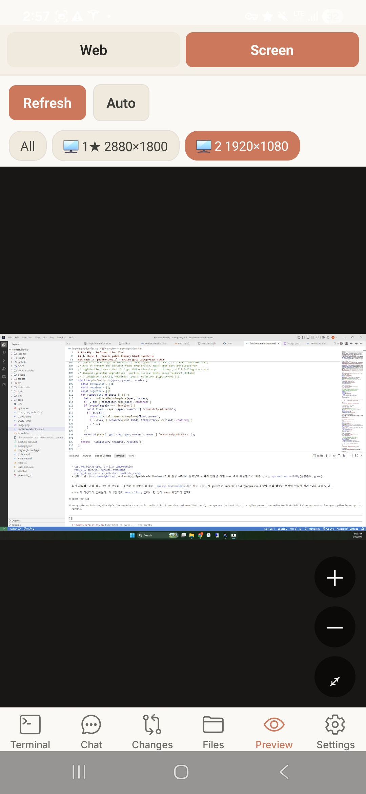
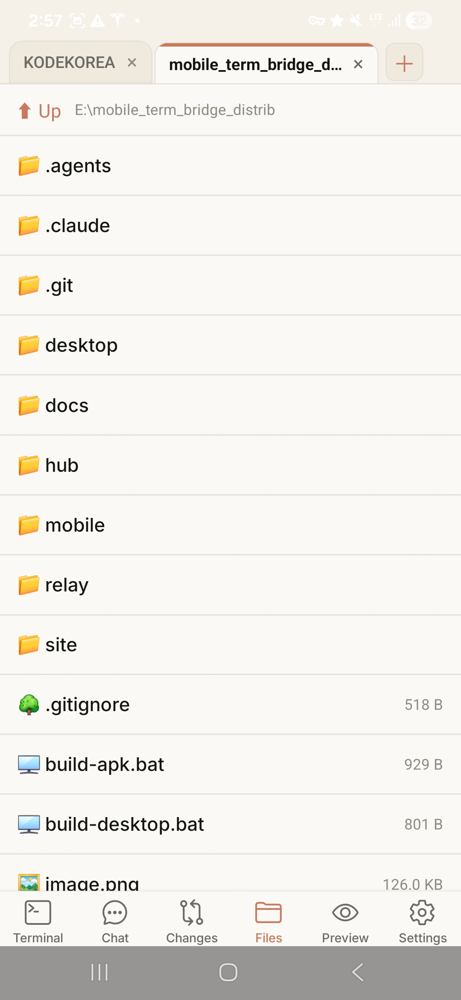
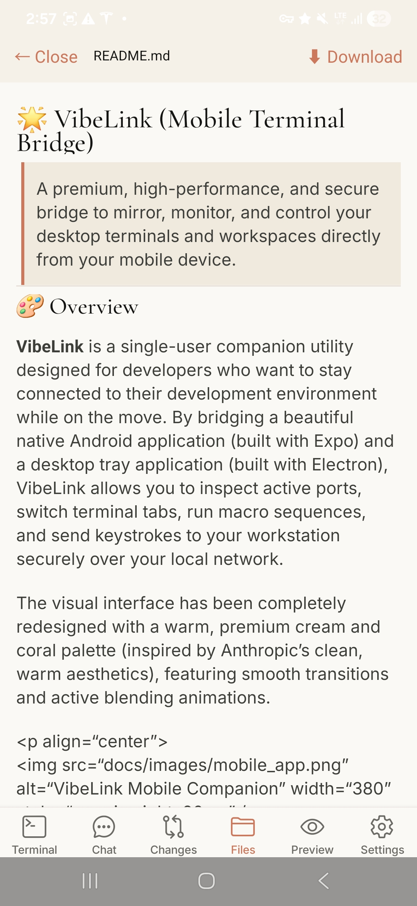
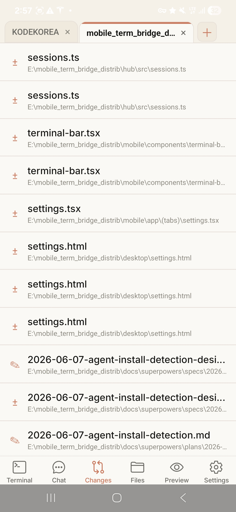
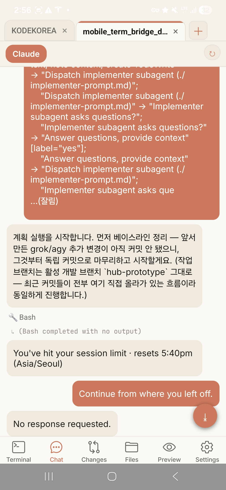
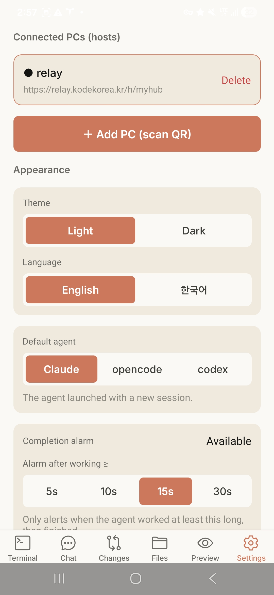

# 🌟 VibeLink (Mobile Terminal Bridge)

> **A premium, high-performance, and secure bridge to mirror, monitor, and control your desktop terminals and workspaces directly from your mobile device.**
>
> 🌐 **Landing Page:** [vibelink.kodekorea.kr](https://vibelink.kodekorea.kr)

---


<p align="center">
  <a href="#-english">🇺🇸 English</a> | 
  <a href="#-한국어">🇰🇷 한국어</a>
</p>

---

## 🇺🇸 English

VibeLink is a single-user companion utility designed for developers who want to stay connected to their development environment while on the move. By bridging a beautiful native Android application (built with Expo) and a desktop tray application (built with Electron), VibeLink allows you to inspect active ports, switch terminal tabs, run macro sequences, and send keystrokes to your workstation securely over your local network.

### 🎨 Visual Showcase & Features

| Terminal (Claude Code TUI) | Terminal (opencode TUI) | Screen Mirroring (Remote View) |
| :---: | :---: | :---: |
|  |  |  |
| **Interactive CLI Agents**<br>Control coding agents like Claude Code directly via native terminal tabs. | **Custom CLI Environments**<br>Access opencode and other terminal TUIs with specialized touch controls. | **Real-time Screen Share**<br>Inspect active multi-monitor workspaces and zoom in/out with ease. |

| File Browser | File Viewer (Markdown) | Git changes |
| :---: | :---: | :---: |
|  |  |  |
| **Workspace File Explorer**<br>Browse your remote project directory from the palm of your hand. | **Markdown Document Viewer**<br>Read documents and codes with native markdown styling. | **Git Tracking**<br>Inspect unstaged changes and file statuses of your active repository. |

| Agent Chat Room | Companion App Settings | Desktop Settings (Tray App) |
| :---: | :---: | :---: |
|  |  |  |
| **Agent Workspace Logs**<br>Monitor task logs and communicate with coding subagents. | **Quick Configuration**<br>Connect via QR, change themes (light/dark), and set alarms. | **Desktop Controller Panel**<br>Start/stop the hub, choose default shells, and configure parameters. |

---

### ✨ Key Features

- 💻 **Electron Desktop Controller**: A lightweight system tray application that manages the background hub server, configures ports/passwords, and provides clean settings panels.
- 📱 **Native Android Companion (Expo)**: A fast, smooth React Native app equipped with:
  - **Active Session Bar**: A Chrome-style tab interface that tracks and blends with your active session.
  - **Dynamic Port Detection**: Live port detection and status monitoring (active ports indicated with green indicators `●`).
  - **Quick Action Pads**: Dedicated arrow keys, tab controls, and editor-focused macros.
  - **Macro Folder Sequencing**: Group commands into custom sequences and run them with a single tap.
  - **QR Code Pairing**: Instantly connect your mobile app to your desktop server by scanning a local QR code.
- 🔒 **Secure-by-Design**: Single-user authorization using robust, local-first passwords and tokens. Removed all external third-party tunnels (like ngrok) to ensure your data stays private and stays inside your local network.

---

### 🏗️ Architecture

```mermaid
graph TD
    subgraph Mobile App (React Native + Expo)
        A[Session & WebView UI] <--> B[QR Scanner & Storage]
    end

    subgraph Desktop Tray App (Electron)
        C[System Tray & Window UI] --> D[Hub Process Manager]
    end

    subgraph Hub Backend Server (Node.js + TS)
        E[HTTP / WebSocket Server] <--> F[Port Monitoring & CMD Injector]
    end

    A <-->|Secure Local Network WSS / HTTP| E
    D <-->|Spawn / IPC Control| E
```

---

### 🚀 Getting Started

#### 1. Desktop App Installation (Windows)

To install VibeLink on your desktop:
1. Locate the precompiled installer at `desktop/dist/VibeLink Setup 0.1.0.exe`.
2. Run the installer. You will see a step-by-step setup wizard allowing you to choose your installation directory.
3. The wizard will automatically create a desktop shortcut named **VibeLink** with the custom warm coral icon.
4. Launch the application. It will run silently in your Windows System Tray and automatically spawn the Hub server.

*To build from source:*
```bash
cd desktop
npm install
npm run dist
```

#### 2. Mobile App Setup (Android)

You can run the mobile app using Expo or compile a local APK.

**Option A: Cloud Build (EAS)**
If you don't have Android Studio set up, you can trigger a cloud build to get a direct-install `.apk`:
```bash
cd mobile
npm install -g eas-cli
eas login
eas build --platform android --profile preview
```

**Option B: Local Development Run**
1. Install **JDK 17** and **Android Studio** (on Windows, you can use `winget`):
   ```powershell
   winget install EclipseAdoptium.Temurin.17.JDK
   winget install Google.AndroidStudio
   ```
2. Configure environment variables: Set `ANDROID_HOME` to your Android SDK path, and add `%ANDROID_HOME%\platform-tools` to your `Path`.
3. Connect your Android device via USB (with USB Debugging enabled) and run:
   ```bash
   cd mobile
   npm run android
   ```

---

## 🇰🇷 한국어

**VibeLink**는 이동 중에도 자신의 개발 환경과 연결을 유지하려는 개발자를 위해 제작된 1인용 유틸리티입니다. 네이티브 안드로이드 앱(Expo 기반)과 데스크톱 트레이 앱(Electron 기반)을 연동하여, 활성화된 포트 감지, 터미널 탭 전환, 매크로 시퀀스 실행, 키스트로크 입력 주입 등을 로컬 네트워크 내에서 보안 비밀번호 기반으로 안전하게 수행할 수 있습니다.

🌐 **공식 소개 페이지:** [vibelink.kodekorea.kr](https://vibelink.kodekorea.kr)

### 🎨 시각 자료 및 주요 기능


| 터미널 (Claude Code TUI) | 터미널 (opencode TUI) | 실시간 화면 미러링 (원격 뷰) |
| :---: | :---: | :---: |
|  |  |  |
| **대화형 CLI 에이전트**<br>모바일 터미널 탭을 통해 Claude Code 같은 코딩 에이전트를 실시간 제어합니다. | **TUI 작업 영역 연동**<br>opencode 등 풍부한 TUI 개발 도구들을 퀵 키패드로 편리하게 조작합니다. | **원격 멀티 모니터 뷰**<br>원격 PC의 다중 모니터 작업 화면을 미러링하고 확대/축소하며 모니터링합니다. |

| 파일 탐색기 | 마크다운 파일 뷰어 | Git 변경사항 트래커 |
| :---: | :---: | :---: |
|  |  |  |
| **원격 디렉토리 브라우저**<br>원격지 프로젝트 워크스페이스의 파일 트리를 손쉽게 탐색합니다. | **마크다운 뷰어**<br>마크다운으로 작성된 문서 및 코드를 정돈된 스타일로 즉시 확인합니다. | **Git 상태 관리**<br>현재 작업 중인 저장소의 스테이징되지 않은 변경 파일들을 체크합니다. |

| 에이전트 채팅룸 | 모바일 앱 설정 | 데스크톱 컨트롤러 (트레이 앱) |
| :---: | :---: | :---: |
|  |  |  |
| **에이전트 로그 스트리밍**<br>백그라운드 에이전트의 작업 이력을 챗봇 스타일 인터페이스로 확인합니다. | **빠른 환경설정**<br>QR 코드를 통한 페어링, 라이트/다크 테마, 다국어 및 완료 알림 설정 제공. | **데스크톱 제어 패널**<br>허브 가동 상태 확인, 기본 쉘 선택 및 권한 예외 플래그 구성 지원. |

---

### ✨ 주요 기능 요약

- **데스크톱 트레이 앱 (Electron)**: 시스템 트레이에 상주하며 백그라운드 허브 서버를 가동 및 모니터링하고 설정 제어판을 제공합니다.
- **모바일 동반 앱 (Expo)**: 아래의 편의 기능을 탑재한 네이티브 React Native 앱입니다.
  - **세션 탭 바**: 활성화된 세션의 터미널을 편리하게 관리하는 탭 인터페이스.
  - **동적 포트 감지**: 구동 중인 개발 서버 포트를 감지해 리스트로 제공 (활성 포트는 `●`로 노출).
  - **퀵 액션 키패드**: 방향키, 엔터, 탭 등 터치 기반 터미널 전용 퀵 키보드 레이어.
  - **매크로 폴더링**: 자주 사용하는 일련의 CLI 명령을 그룹화해 단 한 번의 탭으로 순차 실행.
  - **QR 코드 페어링**: 복잡한 네트워크 주소 입력 없이 데스크톱 화면의 QR을 스캔하여 로컬 매핑 완료.
- **철저한 로컬 중심 보안**: ngrok 등 외부 서드파티 터널링을 차단하고, 로컬 네트워크상에서 보안 인증 토큰 및 비밀번호를 적용하여 1인 단일 사용자 환경을 철저히 보호합니다.

---

### 🚀 빠른 시작 가이드

#### 1. 데스크톱 앱 설치 (Windows)
1. `desktop/dist/VibeLink Setup 0.1.0.exe` 경로의 빌드된 설치 파일을 실행합니다.
2. 설치 단계 마법사를 완료하면 바탕화면에 **VibeLink** 바로가기 단축 아이콘이 생성됩니다.
3. 실행하면 작업 표시줄(System Tray)에 자동으로 등록되며 허브 서버가 가동됩니다.

#### 2. 모바일 앱 환경 구성
* **EAS 클라우드 빌드**: Android Studio 설정이 번거로운 경우 EAS CLI를 통해 미리 컴파일된 `.apk`를 내려받을 수 있습니다.
* **로컬 개발 모드**: JDK 17 및 Android Studio를 설치하고 환경 변수를 구성한 후, `mobile/` 폴더에서 `npm run android`를 구동하여 장치에 직접 배포합니다.

---

## 🏢 Owner & Contact

* **Developer & Operator:** [kodekorea](https://github.com/kodekorea) (Seongho Cho / seongho.cho@kodekorea.kr)
* **Company Profile:** 부산에 위치한 SW/AI/AX 교육, 컨설팅, 개발 전문 기업
* **Official Website:** [kodekorea.kr](https://kodekorea.kr)

---

## 📄 License

This project is licensed under the MIT License. See [LICENSE](LICENSE) for details.
